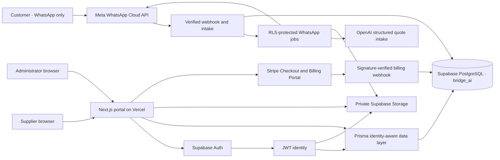

# Bridge AI architecture

## System context

Customers have no portal profile, credentials or session. `customer_contacts` represents a WhatsApp/channel contact and is never an authentication table.

## Identity and authorisation

Supabase Auth owns credentials, email confirmation, password recovery, cookie refresh and session invalidation. The Next.js proxy refreshes Auth cookies. Protected server code calls `supabase.auth.getUser()` rather than trusting browser session data.

The verified Auth UUID maps to `bridge_ai.portal_profiles.id`, whose database foreign key targets `auth.users.id`. Authorisation is relational:

- Supplier: an active `company_memberships` record determines the company and role.
- Administrator: an active `platform_administrators` record, optionally joined to explicit permissions.
- Customer: no portal identity.

Supplier registration and invitation acceptance use narrow `bridge_private` database functions. Each function verifies the Auth identity/email and atomically creates the profile, tenant relationship and audit entry. No signup metadata can grant administrator access. Administrators are deliberately provisioned through a controlled database migration/runbook, never by a public UI.

## Database isolation

Supabase SQL migrations under `supabase/migrations` are the sole DDL history. Prisma describes and queries the resulting schema but does not own a second migration stream.

All 28 `bridge_ai` tables have RLS enabled and forced. The application database role inherits the Supabase `authenticated` role but does not bypass RLS. For each Prisma operation, the data layer starts a transaction and installs the UUID returned by `getUser()` into transaction-local `request.jwt.claim.sub` and the `authenticated` role claim. Policies then evaluate the same protected identity helpers used by direct Supabase requests. Bootstrap access uses a separate, narrowly scoped function rather than a general RLS bypass. WhatsApp webhook and AI workers set distinct transaction-local worker names; policies grant each only the rows and operations required by that worker.

The tenant chain is:

`auth.users → portal_profiles → company_memberships → supplier_companies → supplier-owned records`

Request access additionally requires a valid supplier assignment. Attachments have exactly one allowed parent and, where supplier-owned, an explicit company parent. Administrators see all application rows only while their protected administrator record is active.

## Invariants and audit

Database constraints and triggers enforce rules that cannot safely depend on UI validation:

- case-insensitive unique email identity;
- one primary membership per user/company and at least one active owner per company;
- positive quantities, non-negative price/budget/radius and valid coverage shapes;
- a request cannot exceed its configurable supplier distribution limit;
- supplier distribution is hard-capped at five, all assignments use the request’s shared deadline, and the `Europe/London` response clock pauses from Friday 15:00 until Monday 08:00;
- assignment state and quotation state/timestamps cannot contradict one another;
- a quote cannot be submitted without an approved company and active membership, only one quote per request can be customer-selected, and accepted status requires both a verified paid fee and matching contact grant;
- attachment size and parent relationships are valid;
- coverage rules have exactly one valid shape: postcode area, a bounded radius with validated coordinates, or nationwide; only one active nationwide rule is allowed per supplier;
- audit records are append-only for normal application and authenticated roles.

Material application mutations write an `audit_logs` row in the same transaction. Sensitive access such as protected attachment download and administrator entry is also audited. Audit entries contain identifiers and safe metadata, not plaintext customer secrets.

## Supplier matching

Assignment is a two-stage fail-closed process. The administrator page lists only suppliers that are approved, have an unexpired active membership, sell the request category, have not already been assigned and match at least one active coverage rule. The assignment API reloads and locks the request, repeats the same eligibility query and coverage calculation, then records the selected match type in the audit entry. Client-supplied supplier IDs are never treated as evidence of eligibility.

Coverage can be a UK postcode area/outward code, a 1–500 mile radius around a depot, or nationwide. Multiple distance rows represent multiple depots. Suppliers can enter a postcode or explicitly grant one-time browser geolocation access. The authenticated server route converts device coordinates to the nearest postcode without persisting the exact device coordinates. Server-side Postcodes.io lookup then validates depot postcodes and stores their WGS84 postcode-centroid coordinates. Request postcodes are resolved without sending customer identity or enquiry content. Radius calculations use the Haversine straight-line distance between postcode centroids, not route distance or drive time. Missing or unavailable coordinates never make a distance rule match; postcode and nationwide rules remain usable.

## Private information and files

Customer phone, email and message values use AES-256-GCM with a ciphertext version prefix. Blind indexes allow exact lookup without searchable plaintext. Supplier DTOs disclose only the request data needed to quote.

The Meta webhook boundary validates the verification token for subscription setup and checks `X-Hub-Signature-256` against the exact request bytes before JSON parsing. Requests are size/operation bounded. A SHA-256 body digest and Meta message IDs provide replay protection. Contact profile names, phone values and supported message content are encrypted inside the same transaction that creates append-only audit records. `WebhookEvent.payload` contains only a PII-free operational summary; raw webhook bodies are not retained. Failed processing is recorded with a coarse internal code so Meta can retry without sensitive error text entering logs or tables.

The `bridge-ai-private` Storage bucket is private and migration-provisioned. Supplier-owned objects use keys beneath `companies/<company-id>/...` and policies verify active membership or protected administrator status. The server-only WhatsApp worker writes customer media beneath `customers/<conversation-id>/...`; customers have no Storage credential and supplier policies cannot traverse that prefix. Database attachment metadata holds ownership, MIME/size/checksum and malware scan state. Downloads require authorisation and a `CLEAN` scan state, then receive a short-lived signed URL. A production scanner worker must be implemented before customer uploads can be displayed or downloaded.

## WhatsApp AI workflow

The signed Meta webhook performs no AI or media network calls. In one short transaction it encrypts the customer identity/content, records a PII-free webhook summary, creates a `WhatsAppJob`, writes its audit event and returns to Meta. Next.js `after()` processes the queue immediately; a bearer-protected recovery endpoint can pick up delayed/stale jobs. Claims use `FOR UPDATE SKIP LOCKED`, bounded attempts and an administrator-visible system event on terminal failure.

Before AI processing, Bridge AI identifies itself as automated, links the privacy notice and requires the customer to reply `CONTINUE`. Only message text required for the quote is sent to OpenAI; phone numbers and profile names are omitted. Responses API Structured Outputs produce a schema-validated draft with `store: false` and a blind identifier for abuse controls. Drafts remain encrypted in PostgreSQL. The model can ask questions, but only deterministic server code accepts the exact `CONFIRM` command, validates the UK postcode/category/items and creates the request.

Meta media downloads are restricted to HTTPS Meta-owned hosts and an allow-list of JPG, PNG and PDF types with streaming size limits and checksum verification. Stored objects remain `PENDING` and are represented to the AI only as unavailable attachments. Submitted quotes create idempotent summary jobs. The customer sees at most five anonymous price/lead-time rows and must reply `ACCEPT <number>`; the server re-queries selectable quotations before recording the choice. After Stripe verifies the success fee, a separate idempotent job sends the selected supplier’s business contact details and records the customer notification on the contact grant. Free-form sends are used only within 24 hours of the latest inbound message. Outside that customer-service window quote and contact updates use separate configured, approved utility templates; a missing template fails visibly and creates a system event.

Each `NEW QUOTE` command creates a new timestamped intake session inside the customer conversation. Only messages and attachments from that session can be linked to its request, allowing a trade buyer to manage several unrelated customer jobs safely. Product classification prefers a specific material or system category, and matching requires the supplier to have selected that exact active category. The customer is encouraged to send a photo, drawing or PDF before confirmation because these normally improve price accuracy, but a complete written specification may still proceed.

Supplier accreditation records reference company-owned private attachments. Only company owners and managers can add pending evidence or remove pending/rejected evidence. Suppliers have no update policy for review fields. A protected administrator can approve a document only after its attachment is marked `CLEAN`, or reject it with a supplier-visible reason; both paths append an audit record in the same transaction.

## Supplier approval and operational recovery

Supplier onboarding readiness is calculated from the persisted company profile, product categories, active coverage, business hours, active owner membership and current approved clean accreditation. The same checklist is shown to suppliers and administrators. The administrator API repeats the check and a protected database trigger prevents direct or stale approval attempts, so the UI is never the security boundary. Matching repeats the full readiness check and therefore fails closed if a previously approved supplier later loses required evidence or configuration.

The administrator operations centre reads private failure queues through verified administrator RLS. Failed WhatsApp jobs may be reset only while their status is still `FAILED`; the update is conditional to prevent two administrators retrying the same job. Jobs marked `OUTBOUND_DELIVERY_UNCERTAIN` cannot be retried automatically because the message may already have reached the customer. Safe retries and incident resolution are audit logged. Failed Meta and Stripe webhooks are redelivered from their provider dashboards because Bridge AI deliberately does not retain signed payload bodies.

## Billing and contact release

The recurring supplier membership is £5/month. A quote selected by the customer enters `SELECTED_PENDING_PAYMENT`; it is not called won and no customer contact data is released. The supplier receives two active business hours to pay the fixed £25 success fee. The same Europe/London weekend clock applies, and a protected Vercel cron expires missed windows.

Stripe card data never enters Bridge AI. Checkout redirects are presentation only. The raw-body Stripe webhook verifies its signature before parsing or writing, stores only a sanitized idempotency record, and is the sole payment authority. An on-time payment atomically marks the fee paid, creates a company-scoped `ContactAccessGrant`, accepts the quotation, rejects remaining submitted quotes, closes the request as won, notifies the supplier and writes audit entries. Suppliers still cannot read `CustomerContact` through the Supabase Data API: a reviewed server helper verifies the RLS-visible grant, decrypts only the minimum fields and audits every view. Late captured payments keep contact locked and create a critical refund-review event.

## Runtime and deployment boundaries

Prisma runtime traffic uses the Supavisor transaction pooler. Migrations use the direct/session connection through the Supabase CLI. The Supabase URL and publishable key are browser-safe by design; the secret key, database URIs, encryption keys, WhatsApp keys, AI keys and payment keys must never reach client bundles.

Auth site URLs, redirect allow-lists, production SMTP, email templates, abuse protection and leaked-password screening are Supabase project settings and must be verified separately for every environment.

All HTML responses receive a restrictive baseline content-security policy, clickjacking protection, MIME sniffing protection, a limited referrer policy and a permissions policy. Production additionally requires an HTTPS `APP_URL` and sends HSTS. Auth email redirects fail closed when the production origin is missing or invalid.
