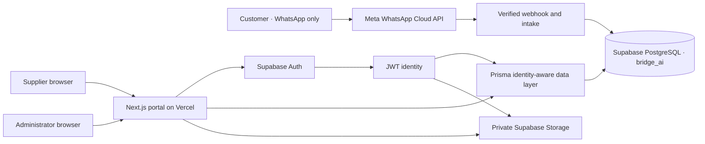

# Bridge AI architecture

## System context

Customers have no portal profile, credentials or session. `customer_contacts` represents a WhatsApp/channel contact and is never an authentication table.

## Identity and authorisation

Supabase Auth owns credentials, email confirmation, password recovery, cookie refresh and session invalidation. The Next.js proxy refreshes Auth cookies. Protected server code calls `supabase.auth.getUser()` rather than trusting browser session data.

The verified Auth UUID maps to `bridge_ai.portal_profiles.id`, whose database foreign key targets `auth.users.id`. Authorisation is relational:

- Supplier: an active `company_memberships` record determines the company and role.
- Administrator: an active `platform_administrators` record, optionally joined to explicit permissions.
- Customer: no portal identity.

Supplier registration and invitation acceptance use narrow `bridge_private` database functions. Each function verifies the Auth identity/email and atomically creates the profile, tenant relationship and audit entry. No signup metadata can grant administrator access. Administrators are deliberately provisioned through a controlled database migration/runbook, never by a public UI.

## Database isolation

Supabase SQL migrations under `supabase/migrations` are the sole DDL history. Prisma describes and queries the resulting schema but does not own a second migration stream.

All 24 `bridge_ai` tables have RLS enabled and forced. The application database role inherits the Supabase `authenticated` role but does not bypass RLS. For each Prisma operation, the data layer starts a transaction and installs the UUID returned by `getUser()` into transaction-local `request.jwt.claim.sub` and the `authenticated` role claim. Policies then evaluate the same protected identity helpers used by direct Supabase requests. Bootstrap access uses a separate, narrowly scoped function rather than a general RLS bypass.

The tenant chain is:

`auth.users → portal_profiles → company_memberships → supplier_companies → supplier-owned records`

Request access additionally requires a valid supplier assignment. Attachments have exactly one allowed parent and, where supplier-owned, an explicit company parent. Administrators see all application rows only while their protected administrator record is active.

## Invariants and audit

Database constraints and triggers enforce rules that cannot safely depend on UI validation:

- case-insensitive unique email identity;
- one primary membership per user/company and at least one active owner per company;
- positive quantities, non-negative price/budget/radius and valid coverage shapes;
- a request cannot exceed its configurable supplier distribution limit;
- assignment state and quotation state/timestamps cannot contradict one another;
- attachment size and parent relationships are valid;
- audit records are append-only for normal application and authenticated roles.

Material application mutations write an `audit_logs` row in the same transaction. Sensitive access such as protected attachment download and administrator entry is also audited. Audit entries contain identifiers and safe metadata, not plaintext customer secrets.

## Private information and files

Customer phone, email and message values use AES-256-GCM with a ciphertext version prefix. Blind indexes allow exact lookup without searchable plaintext. Supplier DTOs disclose only the request data needed to quote.

The `bridge-ai-private` Storage bucket is private and migration-provisioned. Policies require object keys beneath `companies/<company-id>/...` and verify active membership or protected administrator status. Database attachment metadata holds ownership, MIME/size/checksum and malware scan state. Downloads require authorisation and a `CLEAN` scan state, then receive a short-lived signed URL. A production scanner worker must be implemented before untrusted uploads are generally enabled.

## Runtime and deployment boundaries

Prisma runtime traffic uses the Supavisor transaction pooler. Migrations use the direct/session connection through the Supabase CLI. The Supabase URL and publishable key are browser-safe by design; the secret key, database URIs, encryption keys, WhatsApp keys, AI keys and payment keys must never reach client bundles.

Auth site URLs, redirect allow-lists, production SMTP, email templates, abuse protection and leaked-password screening are Supabase project settings and must be verified separately for every environment.
